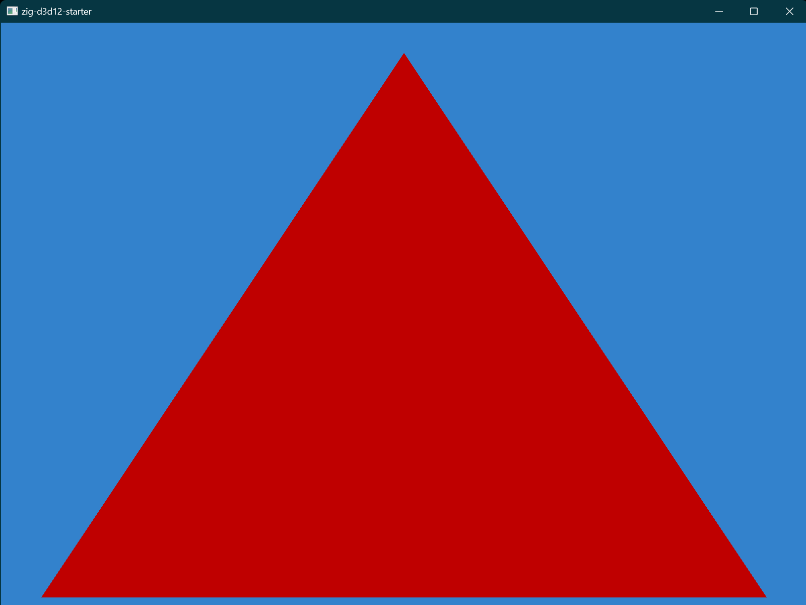

# zig-d3d12-starter

```
git clone https://github.com/michal-z/zig-d3d12-starter.git
cd zig-d3d12-starter
zig build run
```
* Minimal and ready to use project with no dependency except [Zig compiler (master)](https://ziglang.org/download/)
* Shader compiler included
* Agility SDK support
* D3D12 bindings
* D3D12 debug layer and GPU-based validation support
* No libc dependency
* Small output binary (~25 KB in `ReleaseFast` configuration)

Build options:

    -Doptimize=ReleaseFast (generate small and fast binary)
    -Dd3d12-debug=true (enable D3D12 debug layer)
    -Dd3d12-debug-gpu=true (enable D3D12 debug layer and GPU-based validation)

Example:

    zig build run -Doptimize=ReleaseFast -Dd3d12-debug=true


